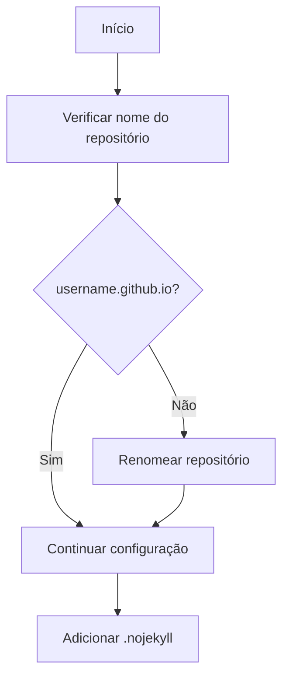
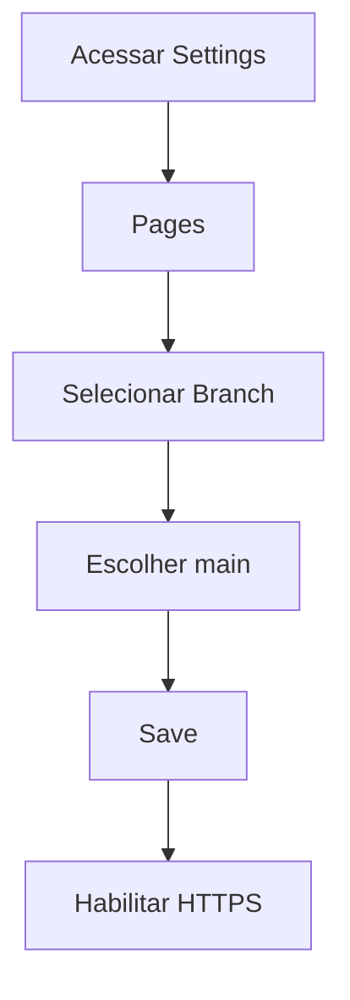

# Plano de Ajuste para GitHub Pages

## Análise do Projeto Atual

### Estrutura Atual
- Site estático usando HTML puro como base
- Conteúdo em Markdown organizado em `/content`
- JavaScript para carregar e renderizar Markdown
- CSS customizado em `/assets/css`
- Sistema de i18n (internacionalização) implementado
- Assets organizados em `/assets`

### Funcionalidades Principais
- Renderização de Markdown
- Troca de idiomas (PT/EN)
- Alternância de tema claro/escuro
- Carregamento dinâmico de conteúdo

## Estratégia de Implantação no GitHub Pages

### 1. Abordagem Escolhida
Optamos por usar HTML estático com `.nojekyll` ao invés de migrar para Jekyll pelos seguintes motivos:
- Mantém a estrutura atual do projeto
- Preserva o funcionamento do JavaScript para carregar Markdown
- Mantém o sistema de i18n atual
- Evita necessidade de migração complexa
- Processo mais simples e direto

### 2. Passos de Configuração

#### 2.1 Preparação do Repositório


1. Verificar se o repositório está nomeado corretamente:
   - Deve ser: `username.github.io`
   - Substituir "username" pelo seu nome de usuário GitHub

2. Criar arquivo `.nojekyll`:
   - Adicionar na raiz do repositório
   - Arquivo deve estar vazio
   - Isso indica ao GitHub Pages para não processar o site com Jekyll

#### 2.2 Configurações do GitHub Pages


1. Acessar configurações do repositório:
   - Ir para a aba "Settings"
   - Navegar até seção "Pages"

2. Configurar source:
   - Branch: main
   - Folder: / (root)

3. Habilitar HTTPS:
   - Marcar opção "Enforce HTTPS"

#### 2.3 Verificação de Caminhos
1. Verificar todos os caminhos relativos:
   ```
   /assets/css/custom.css
   /assets/js/main.js
   /assets/images/avatar.jpg
   /content/posts/
   /content/profile/
   ```

2. Garantir que links internos estão corretos:
   - Links para posts
   - Links para perfil
   - Links para assets

### 3. Testes

#### 3.1 Teste Local
1. Usar servidor local para testar:
   ```powershell
   # Usando Python
   python -m http.server
   
   # OU usando Node
   npx serve
   ```

2. Verificar:
   - Carregamento de conteúdo
   - Troca de idiomas
   - Alternância de temas
   - Links e navegação
   - Carregamento de imagens

#### 3.2 Teste Pós-Deploy
1. Aguardar build (pode levar alguns minutos)
2. Acessar https://username.github.io
3. Realizar os mesmos testes do ambiente local

### 4. Documentação

#### 4.1 Atualizar README.md
- Adicionar instruções de deploy
- Documentar processo de atualização
- Incluir informações sobre a estrutura
- Adicionar notas sobre o GitHub Pages

#### 4.2 Criar CONTRIBUTING.md
- Diretrizes para contribuição
- Processo de criação de posts
- Padrões de formatação Markdown

## Cronograma Sugerido

1. **Dia 1**: Configuração Inicial
   - Ajuste do nome do repositório
   - Criação do .nojekyll
   - Configuração do GitHub Pages

2. **Dia 2**: Verificação e Testes
   - Verificação de caminhos
   - Testes locais
   - Ajustes necessários

3. **Dia 3**: Documentação e Finalização
   - Atualização do README
   - Criação do CONTRIBUTING.md
   - Testes finais

## Considerações de Manutenção

### Posts e Atualizações
1. Manter estrutura de posts:
   ```
   content/posts/[lang]/YYYYMMDD-slug.md
   ```

2. Atualizar índices:
   ```
   content/posts/[lang]/index.json
   ```

### Backup e Segurança
1. Manter backup local do conteúdo
2. Considerar usar branches para:
   - Desenvolvimento
   - Staging
   - Produção

## Conclusão

Este plano fornece uma abordagem estruturada para adaptar o site atual ao GitHub Pages, mantendo todas as funcionalidades existentes e minimizando mudanças na arquitetura atual. A escolha de usar HTML estático com `.nojekyll` permite uma transição suave e mantém a flexibilidade do sistema atual.